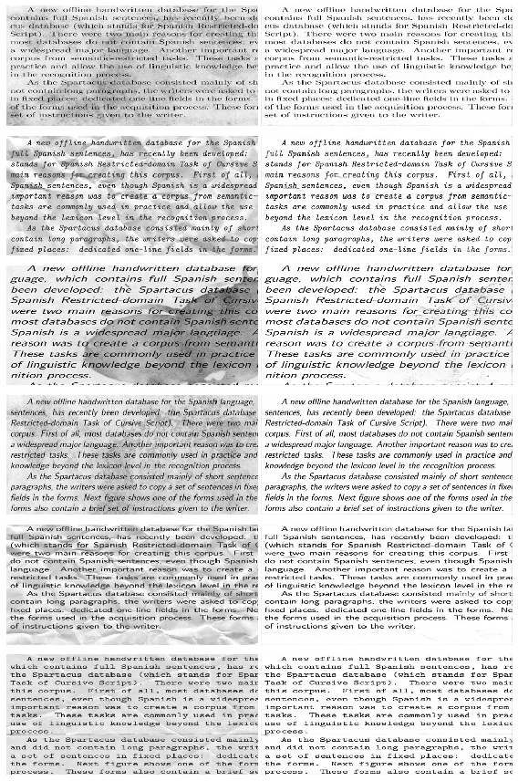

# Kaggle: Denoising Dirty Documents

Data: 177 images of text documents 

Task: clean the images of noise and artifacts (eg. stains, spots, wrinkles)

Evalution: root mean square error between the cleaned vs actual pixel intensities (0...1)

Solution: simple 2D-CNN Autoencoder

Success: 0.088 RMSE

